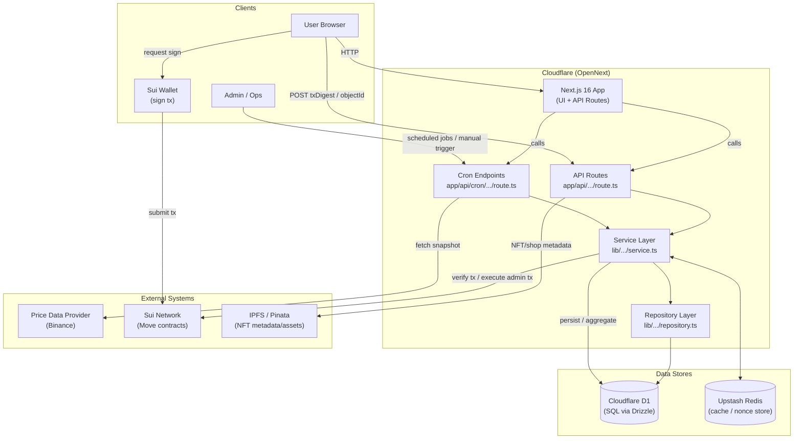

# DeltaX

금(PAXG)과 비트코인(BTC)의 가격 변동을 예측하는 게임화된 베팅 플랫폼

---

## 프로젝트 개요

DeltaX는 금(PAX Gold)과 비트코인의 가격 변동을 예측하고, 다양한 시간대별 베팅 라운드를 통해 유저가 참여할 수 있는 Web2 + Web3 하이브리드 dApp입니다.
베팅은 기존 변동성 대비 변동성을 고려하여 더 높은 상승을 이루어낸 체인이 승리합니다.
베팅으로 얻은 포인트는 NFT, 사이트 내 시각적 상품들로 교환 가능합니다. 재 현금화는 불가능합니다.

**주요 특징**

- 다양한 시간대(1분, 6시간, 1일) 베팅으로 라이트-헤비 유저 모두 수용
- NFT와 게임화 요소로 유저 리텐션 강화
- 투명한 자산 관리(스마트 컨트랙트)와 편리한 UX(웹2 백엔드) 동시 달성

---

## 핵심 기능

### 예측 라운드

1. **1분 단위 예측** - 고정 배당율 방식
2. **6시간 단위 예측** - 라운드별 풀 베팅 (02시, 08시, 14시, 20시 시작)
3. **1일 단위 예측** - 라운드별 풀 베팅

### 재화 시스템

- **del**: 메인 재화. NFT 구매 및 예측 베팅 가능
- **크리스탈**: 환전 재화. 다양한 상점 아이템 구매 가능 (NFT 구매 불가)
- 환전 비율: 100 크리스탈 = 1 SUI

### 게임화 요소

- **NFT**: 지갑 귀속 거래 불가 (A~E 티어, 300,000D ~ 100,000,000D)
- **악세사리**: 닉네임 커스터마이징, 색상 변경 등
- **출석 보상**: 6시간마다 5,000 del 지급

---

## 기술 스택

### Frontend

- React + Next.js 16 + TypeScript
- Tailwind CSS
- @mysten/dapp-kit, @mysten/sui.js

### Backend

- Next.js API Routes
- Sui Blockchain (Move)

### Database

- Cloudflare D1
- Redis (캐싱, 실시간 데이터)
- Pinata IPFS (NFT 메타데이터)

### Deployment

- Cloudflare pages & workers
- TBD

---

## 시스템 아키텍처

---

## 팀 구성

| 김영민 20233130 컴퓨터학부 | NFT & 샵 | NFT 제작, 거래, 닉네임, 업적, 민팅 |
| 김도영 20000000 소프트웨어학부| 메인페이지 & 유저 | 유저, 로그인, 메인페이지, 세션 |
| 김현준 20231795 컴퓨터학부 | 가격 데이터 & 차트 | 차트, 가격 데이터, 비교 기준 확립 |
| 장태웅 20243334 소프트웨어학부 | 라운드 & 베팅 | web2 + web3, 온/오프체인 라운드 관리, 베팅 정산, 데모 |

---

## NFT 및 재화 정책

### NFT 정책

- **Soulbound 구조**: 지갑 귀속으로 전송 및 거래 불가
- **블록체인**: Sui 블록체인(Move 언어) 기반 발행
- **투명성**: 모든 발행 및 소유 이력 블록체인에 영구 기록
- **티어 시스템**: A~E 티어 (300,000D ~ 100,000,000D)

---

## 개발 일정

- **1주차**: 11/5 - 11/11 (프로젝트 설계 및 환경 구축)
- **2주차**: 11/12 - 11/18 (기본 기능 개발)
- **3주차**: 11/19 - 11/25 (핵심 기능 개발)
- **4주차**: 11/26 - 12/2 (통합 및 테스트)
- **5-6주차**: 12/3 - 12/13 (시험기간 - 개발 중단)
- **최종 개발**: 12/14 - 12/16
- **프로젝트 마감**: 12/17

---

## 개발 시작

자세한 실행 방법과 세부 동작 방식 플로우는 [6조 프로젝트 매뉴얼 PDF](./6조_매뉴얼.pdf)를 참고하세요.
팀 개발 환경 설정 및 API 사용 방법은 [docs/](./docs/) 디렉토리를 참고하세요.

---

## 기술 참고

### PAX Gold (PAXG)

- 1 PAXG = 1 트로이온스(fine troy ounce) 금
- ERC-20 토큰 (Ethereum 기반)
- LBMA 인증 금괴 보관
- 2025년 11월 기준 시가총액 $1.3B, 보유자 61,000+

### Sui 블록체인

- Move 프로그래밍 언어 기반
- 객체 중심 모델로 NFT를 일급 시민(first-class citizen)으로 취급
- 높은 처리량과 낮은 지연시간
- NFT의 속성과 권한을 언어 수준에서 관리

---

## 연락처

**숭실대학교 오픈소스기반기초설계**
Team 6 – DeltaX

© 2025 DeltaX
