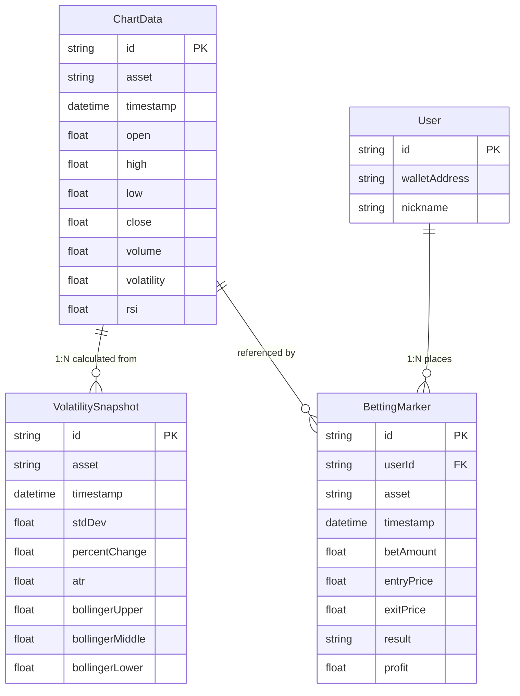

# Chart Module - ERD Design

**작성자**: 김현준
**작성일**: 2025-11-11
**버전**: 1.0

---

## 📊 전체 테이블 구조

```
┌─────────────────────┐
│   ChartData         │  ← 메인 가격 데이터 (OHLCV)
│─────────────────────│
│ id (PK)             │
│ asset               │
│ timestamp           │
│ open                │
│ high                │
│ low                 │
│ close               │
│ volume              │
│ volatility          │
│ rsi                 │
└─────────────────────┘
         │
         │ 1:N
         ↓
┌─────────────────────┐
│ VolatilitySnapshot  │  ← 변동성 지표
│─────────────────────│
│ id (PK)             │
│ asset               │
│ timestamp           │
│ stdDev              │
│ percentChange       │
│ atr                 │
│ bollingerUpper      │
│ bollingerMiddle     │
│ bollingerLower      │
└─────────────────────┘

┌─────────────────────┐
│ PriceAlert          │  ← 가격 알림 (추후 확장)
│─────────────────────│
│ id (PK)             │
│ userId (FK)         │
│ asset               │
│ targetPrice         │
│ condition           │
│ isActive            │
└─────────────────────┘

┌─────────────────────┐
│ BettingMarker       │  ← 베팅 마커 (장태웅 모듈과 연동)
│─────────────────────│
│ id (PK)             │
│ userId (FK)         │
│ asset               │
│ timestamp           │
│ betAmount           │
│ entryPrice          │
│ exitPrice           │
│ result              │
│ profit              │
└─────────────────────┘
```

---

## 1️⃣ ChartData Table

### 목적

- OHLCV(Open, High, Low, Close, Volume) 캔들스틱 데이터 저장
- 기술적 지표 (RSI, 변동성 등) 계산값 캐싱

### Schema (Prisma)

```prisma
model ChartData {
  id        String   @id @default(cuid())
  asset     String   // 'PAXG', 'BTC', 'ETH', 'SOL', etc.
  timestamp DateTime // 캔들 시작 시간

  // OHLCV 데이터
  open      Float
  high      Float
  low       Float
  close     Float
  volume    Float

  // 계산된 지표 (캐시용)
  volatility Float?  // 표준편차
  rsi        Float?  // RSI(14)

  // 메타데이터
  createdAt DateTime @default(now())
  updatedAt DateTime @updatedAt

  // 인덱스
  @@index([asset, timestamp])
  @@unique([asset, timestamp]) // 중복 방지
}
```

### 필드 설명

| 필드         | 타입     | 설명              | 제약조건                   |
| ------------ | -------- | ----------------- | -------------------------- |
| `id`         | String   | 고유 식별자       | PK, CUID                   |
| `asset`      | String   | 자산 심볼         | NOT NULL, 'PAXG', 'BTC' 등 |
| `timestamp`  | DateTime | 캔들 시작 시간    | NOT NULL, UTC              |
| `open`       | Float    | 시가              | NOT NULL, > 0              |
| `high`       | Float    | 고가              | NOT NULL, >= open          |
| `low`        | Float    | 저가              | NOT NULL, <= open          |
| `close`      | Float    | 종가              | NOT NULL, > 0              |
| `volume`     | Float    | 거래량            | NOT NULL, >= 0             |
| `volatility` | Float    | 변동성 (표준편차) | Nullable, 계산값 캐시      |
| `rsi`        | Float    | RSI 지표          | Nullable, 0-100            |

### 인덱스 전략

1. **복합 인덱스**: `(asset, timestamp)`
   - 이유: 특정 자산의 시간대별 조회가 가장 빈번
   - 쿼리 예: `SELECT * FROM ChartData WHERE asset='BTC' AND timestamp >= ?`

2. **UNIQUE 제약**: `(asset, timestamp)`
   - 이유: 동일 자산의 동일 시간대 데이터 중복 방지

### 샘플 데이터

```sql
INSERT INTO ChartData (id, asset, timestamp, open, high, low, close, volume, volatility, rsi) VALUES
('clx1', 'PAXG', '2025-11-11 00:00:00', 2650.50, 2655.00, 2648.00, 2652.30, 125000.00, 2.45, 58.3),
('clx2', 'BTC', '2025-11-11 00:00:00', 45000.00, 45500.00, 44800.00, 45200.00, 2500000.00, 250.75, 62.1);
```

### 예상 데이터 볼륨

- **1분 캔들**: 1,440개/일/자산
- **지원 자산**: 6개 (PAXG, BTC, ETH, SOL, USDT, USDC)
- **보관 기간**: 90일
- **예상 레코드 수**: 1,440 × 6 × 90 = **777,600개**

---

## 2️⃣ VolatilitySnapshot Table

### 목적

- 변동성 지표의 스냅샷 저장
- 복잡한 계산 결과를 캐싱하여 API 응답 속도 향상

### Schema (Prisma)

```prisma
model VolatilitySnapshot {
  id        String   @id @default(cuid())
  asset     String
  timestamp DateTime

  // 기본 변동성 지표
  stdDev        Float   // 표준편차
  percentChange Float   // 변동률 (%)
  atr           Float?  // Average True Range

  // 볼린저 밴드
  bollingerUpper  Float?
  bollingerMiddle Float?
  bollingerLower  Float?
  bollingerBandwidth Float? // 밴드폭 (%)

  // 추가 지표
  macd          Float?  // MACD 라인
  macdSignal    Float?  // Signal 라인
  macdHistogram Float?  // 히스토그램

  createdAt DateTime @default(now())

  @@index([asset, timestamp])
  @@unique([asset, timestamp])
}
```

### 필드 설명

| 필드              | 타입  | 설명                   | 범위        |
| ----------------- | ----- | ---------------------- | ----------- |
| `stdDev`          | Float | 표준편차               | > 0         |
| `percentChange`   | Float | 변동률                 | -100 ~ +100 |
| `atr`             | Float | Average True Range     | > 0         |
| `bollingerUpper`  | Float | 볼린저 밴드 상단       | > middle    |
| `bollingerMiddle` | Float | 볼린저 밴드 중간 (SMA) | > 0         |
| `bollingerLower`  | Float | 볼린저 밴드 하단       | < middle    |

### 업데이트 주기

- **실시간 계산**: WebSocket으로 새 가격 데이터 수신 시
- **배치 계산**: 매 1분마다 Cron Job으로 과거 데이터 재계산
- **보관 기간**: 30일 (이후 삭제)

---

## 3️⃣ BettingMarker Table

### 목적

- 차트 위에 표시할 베팅 마커 정보
- 베팅 시스템(장태웅)과의 연동 인터페이스

### Schema (Prisma)

```prisma
model BettingMarker {
  id         String   @id @default(cuid())
  userId     String   // User 테이블 FK
  asset      String   // 베팅한 자산
  timestamp  DateTime // 베팅 시점

  // 베팅 정보
  betAmount  Float    // 베팅 금액
  entryPrice Float    // 진입 가격
  exitPrice  Float?   // 청산 가격 (결과 확정 시)

  // 결과
  result     String?  // 'win', 'lose', 'pending'
  profit     Float?   // 손익 (exitPrice - entryPrice) * betAmount

  // 메타데이터
  createdAt  DateTime @default(now())
  updatedAt  DateTime @updatedAt

  // 인덱스
  @@index([userId, asset])
  @@index([timestamp])
}
```

### 필드 설명

| 필드     | 타입   | 설명      | 제약조건                 |
| -------- | ------ | --------- | ------------------------ |
| `userId` | String | 사용자 ID | FK → User.id             |
| `result` | String | 베팅 결과 | 'win', 'lose', 'pending' |
| `profit` | Float  | 손익 금액 | 양수=이익, 음수=손실     |

### 베팅 시스템과의 연동

```typescript
// 베팅 생성 시 (장태웅 모듈 → 차트 모듈)
interface BettingCreatedEvent {
  userId: string;
  asset: AssetType;
  timestamp: number;
  betAmount: number;
  entryPrice: number;
}

// 베팅 결과 확정 시 (장태웅 모듈 → 차트 모듈)
interface BettingSettledEvent {
  markerId: string;
  exitPrice: number;
  result: 'win' | 'lose';
  profit: number;
}
```

---

## 4️⃣ 관계형 다이어그램 (ERD)



---

## 5️⃣ 쿼리 최적화 전략

### 자주 사용되는 쿼리

#### 1. 시간 범위별 가격 데이터 조회

```sql
SELECT * FROM ChartData
WHERE asset = 'BTC'
  AND timestamp >= NOW() - INTERVAL '24 hours'
ORDER BY timestamp ASC;
```

**최적화**: `(asset, timestamp)` 복합 인덱스 활용

#### 2. 최신 변동성 지표 조회

```sql
SELECT * FROM VolatilitySnapshot
WHERE asset = 'PAXG'
ORDER BY timestamp DESC
LIMIT 1;
```

**최적화**: `(asset, timestamp DESC)` 인덱스

#### 3. 사용자별 베팅 마커 조회

```sql
SELECT * FROM BettingMarker
WHERE userId = 'user123'
  AND asset = 'BTC'
  AND timestamp >= NOW() - INTERVAL '7 days';
```

**최적화**: `(userId, asset, timestamp)` 복합 인덱스

---

## 6️⃣ 데이터 파티셔닝 전략 (추후 확장)

### Range Partitioning by Timestamp

```sql
-- 월별 파티션 (PostgreSQL 예시)
CREATE TABLE ChartData_2025_11 PARTITION OF ChartData
    FOR VALUES FROM ('2025-11-01') TO ('2025-12-01');

CREATE TABLE ChartData_2025_12 PARTITION OF ChartData
    FOR VALUES FROM ('2025-12-01') TO ('2026-01-01');
```

**장점**:

- 과거 데이터 조회 성능 향상
- 오래된 파티션 쉽게 삭제 가능

---

## 7️⃣ 캐싱 전략 (Redis)

### Key 구조

```
chart:price:{asset}:latest          → 최신 가격 (TTL: 5초)
chart:candles:{asset}:{timeRange}   → 캔들 데이터 캐시 (TTL: 1분)
chart:volatility:{asset}:latest     → 최신 변동성 (TTL: 10초)
```

### 예시

```redis
# 최신 BTC 가격
SET chart:price:BTC:latest '{"price":45200,"timestamp":1699776000}' EX 5

# 24시간 캔들 데이터 (JSON 배열)
SET chart:candles:BTC:24h '[{...}, {...}]' EX 60
```

---

## 8️⃣ 마이그레이션 전략

### Phase 1: 초기 스키마 생성

```bash
npx prisma migrate dev --name init-chart-schema
```

### Phase 2: 샘플 데이터 삽입

```bash
npx prisma db seed
```

### Phase 3: 인덱스 추가 (성능 모니터링 후)

```sql
CREATE INDEX idx_chartdata_asset_timestamp ON ChartData(asset, timestamp);
```

---

## 📌 다른 모듈과의 인터페이스

### ← 받는 데이터 (Dependencies)

| 제공 모듈         | 데이터                | 용도                    |
| ----------------- | --------------------- | ----------------------- |
| **김도영 (유저)** | `User.id`             | 베팅 마커 사용자 식별   |
| **장태웅 (베팅)** | `BettingRound`, `Bet` | 베팅 마커 생성/업데이트 |

### → 제공하는 데이터 (Provides)

| 사용 모듈         | 제공 데이터           | API                            |
| ----------------- | --------------------- | ------------------------------ |
| **장태웅 (베팅)** | 실시간 가격           | `GET /api/chart/price/{asset}` |
| **김영민 (NFT)**  | 가격 히스토리         | `GET /api/chart/historical`    |
| **전체**          | WebSocket 가격 스트림 | `WS /api/chart/realtime`       |

---

## 🚀 Next Steps

1. ✅ ERD 문서 완성
2. [ ] Prisma schema 파일 작성
3. [ ] 팀원 리뷰 및 피드백 반영
4. [ ] 데이터베이스 마이그레이션 실행
5. [ ] 샘플 데이터 생성 스크립트 작성

---

**문서 상태**: ✅ Draft Complete
**팀 리뷰**: ⏳ Pending
**승인**: ⏳ Pending
