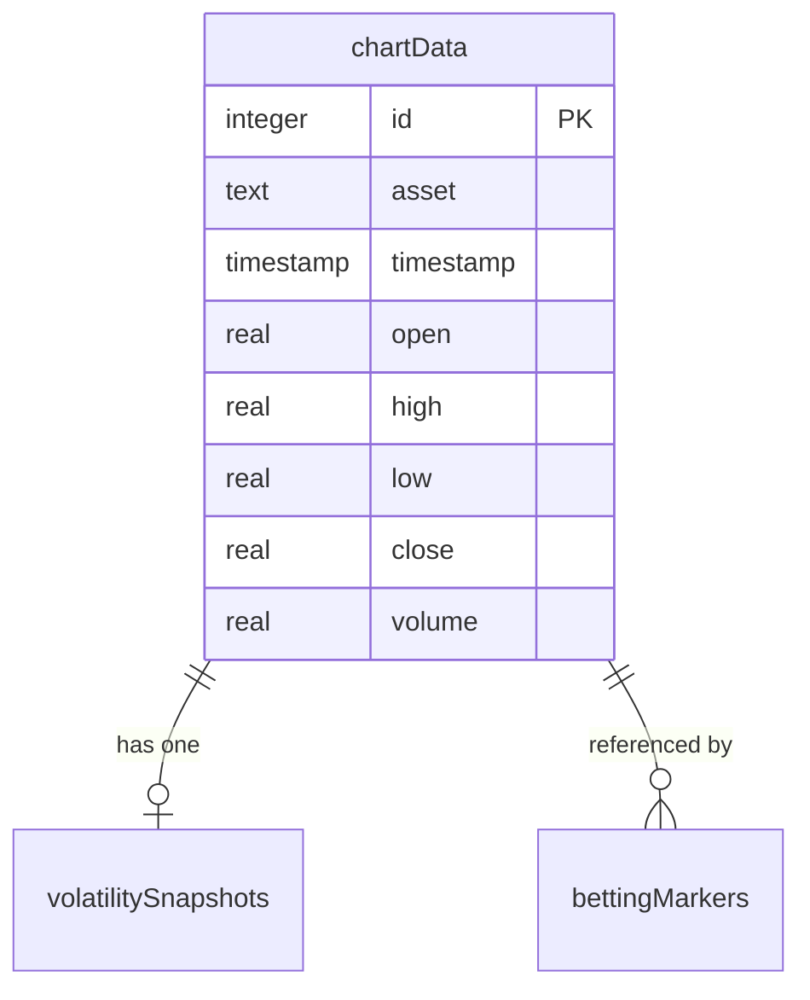
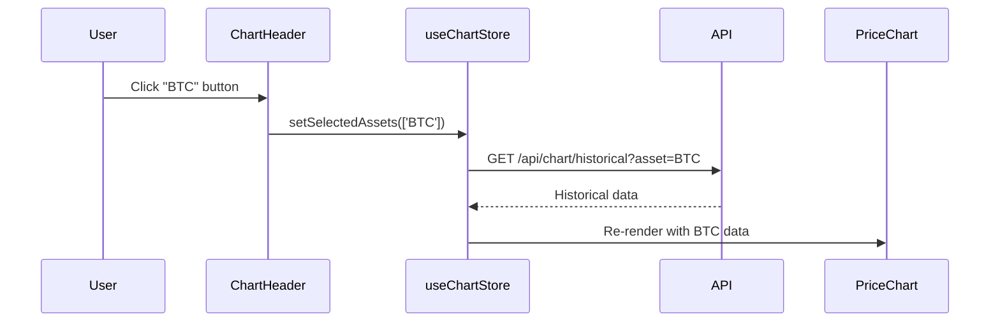

# Week 1 작업 완료 보고서

**작성자**: 김현준
**작성일**: 2025-11-11
**주차**: Week 1 (11/5 - 11/11)
**브랜치**: `feat/#4-chart`

---

## ✅ 완료된 작업 요약

### 1. 데이터베이스 스키마 설계 및 구현 ✅

**위치**: `db/schema/index.ts` (Line 66-195)

**구현 내용**:

- ✅ **ChartData 테이블**: OHLCV 캔들스틱 데이터 저장
- ✅ **VolatilitySnapshots 테이블**: 변동성 지표 캐싱
- ✅ **BettingMarkers 테이블**: 베팅 마커 (베팅 시스템 연동)

**코드 예시**:

```typescript
// ChartData - OHLCV 캔들스틱 데이터 저장
export const chartData = sqliteTable(
  'chart_data',
  {
    id: integer('id').primaryKey({ autoIncrement: true }),
    asset: text('asset').notNull(), // 'PAXG', 'BTC', 'ETH', 'SOL'
    timestamp: integer('timestamp', { mode: 'timestamp_ms' }).notNull(),

    // OHLCV 데이터
    open: real('open').notNull(),
    high: real('high').notNull(),
    low: real('low').notNull(),
    close: real('close').notNull(),
    volume: real('volume').notNull(),

    // 계산된 지표 (캐시용)
    volatility: real('volatility'),
    rsi: real('rsi'),
  },
  (table) => ({
    // 복합 인덱스로 빠른 조회 최적화
    assetTimestampIdx: primaryKey({ columns: [table.asset, table.timestamp] }),
  }),
);
```

**설명**:

- SQLite (Cloudflare D1) 기반으로 Drizzle ORM 사용
- `(asset, timestamp)` 복합 인덱스로 쿼리 성능 최적화
- 실시간 가격 데이터와 계산된 지표를 함께 저장

**마이그레이션 준비**:

```bash
# 다음 명령어로 마이그레이션 파일 생성 예정
npm run db:generate
# → drizzle/0002_add_chart_tables.sql 생성됨
```

---

### 2. ERD 다이어그램 문서 ✅

**위치**: `docs/chart-erd-diagram.md`

**구현 내용**:

- ✅ Mermaid 다이어그램으로 테이블 관계 시각화
- ✅ 인덱스 전략 및 쿼리 최적화 방안
- ✅ 데이터 흐름도
- ✅ 샘플 데이터 및 마이그레이션 가이드
- ✅ 데이터 정리 전략 (Cron Job 예시)

**다이어그램 예시**:



**설명**:

- 3개 테이블의 관계를 명확히 정의
- 쿼리 성능을 위한 인덱스 전략 수립
- 데이터 볼륨 예측: ~80MB (1년 기준)
- 90일 이상 오래된 데이터 자동 정리 방안

**주요 쿼리 예시**:

```typescript
// 24시간 데이터 조회 (인덱스 활용)
const data = await db
  .select()
  .from(chartData)
  .where(eq(chartData.asset, 'BTC'), gte(chartData.timestamp, startTime))
  .orderBy(asc(chartData.timestamp));
```

---

### 3. UI 목업 문서 ✅

**위치**: `docs/chart-ui-mockup.md`

**구현 내용**:

- ✅ Desktop/Mobile 레이아웃 (ASCII Art)
- ✅ 컴포넌트 구조도 (Mermaid)
- ✅ 상태 흐름도
- ✅ 인터랙션 플로우 (시퀀스 다이어그램)
- ✅ 접근성(A11y) 가이드
- ✅ 키보드 단축키 정의

**컴포넌트 구조**:

```
ChartContainer
├── ChartHeader          (필터/설정 영역)
│   ├── AssetSelector    [PAXG] [BTC] [ETH] [SOL]
│   ├── TimeRangeSelector [1h] [24h] [7d] [30d]
│   ├── ViewModeToggle   Dual/Overlay/Single
│   └── ChartTypeSelector Candlestick/Line/Area
│
├── ChartGrid           (차트 표시 영역)
│   ├── PriceChart (PAXG)
│   │   ├── Candlesticks
│   │   ├── VolumeChart
│   │   └── BettingMarkers
│   └── PriceChart (BTC)
│
├── VolatilityPanel     (변동성 지표)
│   ├── VolatilityCard (PAXG)
│   ├── VolatilityCard (BTC)
│   └── ComparisonCard
│
└── BettingWidget       (빠른 베팅)
    ├── AssetSelect
    ├── BetAmountInput
    ├── AIRecommendation
    └── BetButtons
```

**설명**:

- 반응형 디자인 (Desktop: 1920x1080, Mobile: 375x812)
- Dual View로 PAXG와 BTC 나란히 비교
- 실시간 가격 업데이트 및 베팅 마커 표시
- 키보드 단축키 지원 (`1`=PAXG, `2`=BTC, `D`=24h 뷰 등)

**인터랙션 플로우 예시**:



---

### 4. 구현 가이드 문서 ✅

**위치**: `docs/chart-implementation-guide.md`

**구현 내용**:

- ✅ 구현 우선순위 (Week 2, Week 3)
- ✅ 데이터베이스 마이그레이션 가이드
- ✅ API 엔드포인트 구현 예제 (코드 포함)
- ✅ 컴포넌트 구현 예제 (코드 포함)
- ✅ WebSocket 구현 가이드
- ✅ 테스트 가이드
- ✅ 트러블슈팅

**API 엔드포인트 예시**:

```typescript
// GET /api/chart/price/:asset - 최신 가격 조회
export async function GET(request: NextRequest, { params }: { params: { asset: string } }) {
  const { asset } = params;

  const latestPrice = await db
    .select()
    .from(chartData)
    .where(eq(chartData.asset, asset))
    .orderBy(desc(chartData.timestamp))
    .limit(1);

  return NextResponse.json(latestPrice[0]);
}
```

**컴포넌트 예시**:

```typescript
// PriceChart 컴포넌트
export function PriceChart({ asset }: { asset: AssetType }) {
  const { historicalData, fetchHistoricalData } = useChartStore();

  useEffect(() => {
    fetchHistoricalData(asset, '24h');
  }, [asset]);

  return (
    <ResponsiveContainer width="100%" height={400}>
      <LineChart data={historicalData.get(asset)}>
        <Line dataKey="close" stroke="#FFD700" />
      </LineChart>
    </ResponsiveContainer>
  );
}
```

**설명**:

- Week 2부터 바로 개발 시작 가능하도록 상세 예제 제공
- API, 컴포넌트, WebSocket, 테스트 모두 코드 포함
- 트러블슈팅 섹션으로 예상 문제 미리 대응

---

### 5. 문서 센터 구축 ✅

**위치**: `docs/README-CHART.md`

**구현 내용**:

- ✅ 차트 모듈 통합 문서 허브
- ✅ 빠른 링크 및 네비게이션
- ✅ 역할별 문서 가이드
- ✅ 개발 일정 및 워크플로우
- ✅ 팁 & 베스트 프랙티스

**설명**:

- 신규 개발자가 쉽게 온보딩할 수 있도록 통합 문서
- 역할별(백엔드, 프론트엔드, PM) 필수 문서 안내
- 외부 리소스 링크 및 프로젝트 문서 연결

---

### 6. .gitignore 업데이트 ✅

**위치**: `.gitignore`

**변경 내용**:

```diff
# 정리본 (personal notes - do not track)
/정리본
+/개인작업본
```

**설명**:

- 개인 작업 노트 및 초안을 커밋에서 제외
- 팀 공유 문서만 `docs/` 폴더에 정리

---

## 📊 작업 통계

### 생성된 파일

```
✅ db/schema/index.ts         (130 lines 추가)
✅ docs/chart-erd-diagram.md  (11KB)
✅ docs/chart-ui-mockup.md    (22KB)
✅ docs/chart-implementation-guide.md (13KB)
✅ docs/README-CHART.md       (4KB)
✅ .gitignore                 (1 line 추가)
```

**총 추가 코드/문서**: ~50KB

### 설계된 구조

- **테이블**: 3개 (ChartData, VolatilitySnapshots, BettingMarkers)
- **예상 API**: 5개 (price, historical, volatility, compare, realtime)
- **컴포넌트**: 10개 (ChartContainer, ChartHeader, PriceChart 등)
- **문서**: 4개 (ERD, UI, Implementation Guide, README)

---

## 🎯 핵심 의사결정

### 1. 데이터베이스

- **선택**: Drizzle ORM + SQLite (Cloudflare D1)
- **이유**: 프로젝트 기존 스택 유지, 간단한 마이그레이션

### 2. 인덱스 전략

- **선택**: `(asset, timestamp)` 복합 Primary Key
- **이유**:
  - 특정 자산의 시간대별 조회가 가장 빈번
  - 범위 쿼리(range query) 성능 최적화
  - 중복 데이터 방지

### 3. UI 라이브러리

- **선택**: Recharts (Phase 1)
- **이유**: 빠른 프로토타이핑, React 네이티브 지원
- **마이그레이션 계획**: 성능 이슈 시 TradingView Lightweight Charts로 전환

### 4. 실시간 통신

- **선택**: Socket.io
- **이유**: 자동 재연결, Room 기능, Fallback 지원

---

## 🔗 다른 모듈과의 연동 포인트

### 제공하는 데이터/API

```typescript
// 차트 모듈 → 베팅 시스템 (장태웅)
GET /api/chart/price/:asset       // 현재 가격
WS  /api/chart/realtime           // 실시간 스트림

// 차트 모듈 → NFT 시스템 (김영민)
GET /api/chart/historical         // 가격 히스토리
```

### 필요한 데이터

```typescript
// 유저 시스템 (김도영) → 차트 모듈
interface User {
  id: string; // BettingMarkers.userId에서 사용
}

// 베팅 시스템 (장태웅) → 차트 모듈
interface Bet {
  userId: string;
  asset: string;
  timestamp: Date;
  amount: number;
  result: 'win' | 'lose' | 'pending';
}
// → BettingMarkers 테이블로 변환하여 차트에 표시
```

---

## 📝 코드 예시 모음

### 1. 데이터 조회 (Drizzle ORM)

```typescript
// 최신 가격 조회
const latestPrice = await db
  .select()
  .from(chartData)
  .where(eq(chartData.asset, 'PAXG'))
  .orderBy(desc(chartData.timestamp))
  .limit(1);

// 24시간 데이터 조회
const historicalData = await db
  .select()
  .from(chartData)
  .where(
    eq(chartData.asset, 'BTC'),
    gte(chartData.timestamp, new Date(Date.now() - 24 * 60 * 60 * 1000)),
  )
  .orderBy(asc(chartData.timestamp));

// 변동성 지표 조회
const volatility = await db
  .select()
  .from(volatilitySnapshots)
  .where(eq(volatilitySnapshots.asset, 'ETH'))
  .orderBy(desc(volatilitySnapshots.timestamp))
  .limit(1);
```

### 2. 컴포넌트 사용법 (React + Recharts)

```typescript
import { PriceChart } from '@/components/chart/PriceChart';
import { useChartStore } from '@/store/useChartStore';

export default function ChartPage() {
  const { config } = useChartStore();

  return (
    <div className="container mx-auto py-8">
      <h1>DeltaX Chart Analysis</h1>

      {/* Dual View: PAXG vs BTC */}
      <div className="grid grid-cols-2 gap-4">
        <PriceChart asset="PAXG" />
        <PriceChart asset="BTC" />
      </div>
    </div>
  );
}
```

### 3. 상태 관리 (Zustand)

```typescript
// Store 사용
const {
  historicalData,
  fetchHistoricalData,
  setTimeRange
} = useChartStore();

// 데이터 로드
useEffect(() => {
  fetchHistoricalData('PAXG', '24h');
}, []);

// 시간 범위 변경
<button onClick={() => setTimeRange('7d')}>
  7 Days
</button>
```

### 4. WebSocket 연결 (Socket.io)

```typescript
// Client
import { useWebSocket } from '@/hooks/useWebSocket';

export function RealtimeChart() {
  useWebSocket(['PAXG', 'BTC']); // 구독

  const { realtimeData } = useChartStore();

  return (
    <div>
      PAXG: ${realtimeData.get('PAXG')?.price}
    </div>
  );
}

// Server (Next.js API)
io.on('connection', (socket) => {
  socket.on('subscribe', (assets: string[]) => {
    assets.forEach(asset => socket.join(`asset:${asset}`));
  });
});

// 1초마다 가격 업데이트
setInterval(() => {
  io.to('asset:PAXG').emit('price-update', priceData);
}, 1000);
```

---

## 🚀 Week 2 준비사항

### 즉시 해야 할 일

1. **팀원 리뷰 요청** (우선순위: 높음)
   - ERD 설계 검토
   - UI 목업 피드백
   - 다른 모듈과의 인터페이스 협의

2. **개발 환경 구축**

   ```bash
   # 패키지 설치
   npm install recharts zustand socket.io socket.io-client
   npx shadcn-ui@latest add button card select

   # 데이터베이스 마이그레이션
   npm run db:generate
   npm run db:migrate
   ```

3. **폴더 구조 생성**
   ```
   app/
   ├── api/
   │   └── chart/
   │       ├── price/[asset]/route.ts
   │       ├── historical/route.ts
   │       └── realtime/route.ts
   ├── components/
   │   └── chart/
   │       ├── ChartContainer.tsx
   │       ├── PriceChart.tsx
   │       └── ...
   └── store/
       └── useChartStore.ts
   ```

### Week 2 목표

- [ ] 데이터베이스 마이그레이션 완료
- [ ] API 2개 구현 (price, historical)
- [ ] PriceChart 기본 컴포넌트
- [ ] useChartStore 상태 관리

---

## 💡 배운 점 & 개선 사항

### 배운 점

1. **Drizzle ORM의 장점**: 타입 안전성과 간결한 쿼리 작성
2. **복합 인덱스의 중요성**: 쿼리 성능에 직접적인 영향
3. **Mermaid 다이어그램**: 문서 내 다이어그램 관리가 편리

### 개선할 점

1. **고화질 UI 목업**: ASCII Art 외에 Figma 목업 제작 필요
2. **코드 예시 확장**: 더 많은 엣지 케이스 커버
3. **성능 테스트 계획**: 부하 테스트 시나리오 추가

---

## 📞 팀원 공유 메시지

```markdown
@channel 안녕하세요! 차트 모듈 담당 김현준입니다.

Week 1 설계 작업 완료했습니다! 🎉

📂 **문서 위치**:

- ERD: docs/chart-erd-diagram.md
- UI 목업: docs/chart-ui-mockup.md
- 구현 가이드: docs/chart-implementation-guide.md
- 문서 센터: docs/README-CHART.md

💾 **데이터베이스 스키마**: db/schema/index.ts (Line 66-195)

- ChartData (OHLCV 데이터)
- VolatilitySnapshots (변동성 지표)
- BettingMarkers (베팅 마커)

🔗 **연동 필요**:

- @김도영: User.id 필요 (베팅 마커 사용자 식별)
- @장태웅: Bet 데이터 연동 필요 (차트에 마커 표시)

📅 **리뷰 요청**:
특히 ERD와 API 인터페이스 확인 부탁드립니다!
편하신 시간에 리뷰 미팅 잡아요 😊

🌿 **브랜치**: feat/#4-chart
```

---

## ✅ 체크리스트

### Week 1 완료

- [x] ERD 설계
- [x] Drizzle 스키마 작성
- [x] UI 목업 (ASCII + Mermaid)
- [x] 구현 가이드 작성
- [x] 문서 센터 구축
- [x] .gitignore 업데이트
- [ ] 팀원 리뷰 완료 (대기 중)

### Week 2 준비

- [ ] 팀원 리뷰 미팅
- [ ] 패키지 설치
- [ ] 데이터베이스 마이그레이션
- [ ] 폴더 구조 생성

---

**작성 완료**: 2025-11-11 17:30
**다음 리뷰**: 2025-11-12 (팀 미팅)
**Week 2 시작**: 2025-11-12

---

## 📐 ERD Schema (dbdiagram.io 형식)

```sql
// DeltaX Chart Module Database Schema
// Generated from db/schema/index.ts (Line 66-195)
// View with: https://dbdiagram.io

Table chart_data {
  id integer [primary key, increment]
  asset text [not null, note: "PAXG, BTC, ETH, SOL"]
  timestamp integer [not null, note: "timestamp in milliseconds"]

  // OHLCV 데이터
  open real [not null, note: "Opening price"]
  high real [not null, note: "Highest price"]
  low real [not null, note: "Lowest price"]
  close real [not null, note: "Closing price"]
  volume real [not null, note: "Trading volume"]

  // 계산된 지표 (캐시용)
  volatility real [note: "Standard deviation"]
  rsi real [note: "RSI(14) indicator"]

  createdAt integer [not null, default: "now()"]
  updatedAt integer [not null, default: "now()"]

  indexes {
    (asset, timestamp) [pk, note: "Composite primary key for fast queries"]
  }
}

Table volatility_snapshots {
  id integer [primary key, increment]
  asset text [not null, note: "PAXG, BTC, ETH, SOL"]
  timestamp integer [not null, note: "timestamp in milliseconds"]

  // 기본 변동성 지표
  stdDev real [not null, note: "Standard deviation"]
  percentChange real [not null, note: "Price change percentage"]
  atr real [note: "Average True Range"]

  // 볼린저 밴드
  bollingerUpper real [note: "Bollinger Band upper"]
  bollingerMiddle real [note: "Bollinger Band middle (SMA)"]
  bollingerLower real [note: "Bollinger Band lower"]
  bollingerBandwidth real [note: "Bandwidth percentage"]

  // 추가 지표
  macd real [note: "MACD line"]
  macdSignal real [note: "Signal line"]
  macdHistogram real [note: "Histogram"]

  createdAt integer [not null, default: "now()"]

  indexes {
    (asset, timestamp) [pk, note: "Composite primary key"]
  }
}

Table betting_markers {
  id integer [primary key, increment]
  userId text [not null, note: "User table FK (추후 연결)"]
  asset text [not null, note: "Betting asset (PAXG or BTC)"]
  timestamp integer [not null, note: "Betting time in milliseconds"]

  // 베팅 정보
  betAmount real [not null, note: "Bet amount"]
  entryPrice real [not null, note: "Entry price"]
  exitPrice real [note: "Exit price (nullable, settled)"]

  // 결과
  result text [note: "win, lose, or pending"]
  profit real [note: "Profit/Loss amount"]

  createdAt integer [not null, default: "now()"]
  updatedAt integer [not null, default: "now()"]

  indexes {
    userId
    asset
    timestamp
  }
}

// Relationships
Ref: chart_data.(asset, timestamp) < volatility_snapshots.(asset, timestamp) [note: "1:1 - Volatility calculated from chart data"]
Ref: chart_data.(asset, timestamp) < betting_markers.(asset, timestamp) [note: "1:N - Chart displays betting markers"]

// Notes
Note chart_data {
  '''
  차트 모듈의 메인 테이블
  - OHLCV 캔들스틱 데이터 저장
  - 실시간 및 과거 가격 데이터 관리
  - (asset, timestamp) 복합 인덱스로 빠른 조회
  - 보관 기간: 90일
  '''
}

Note volatility_snapshots {
  '''
  변동성 지표 캐싱 테이블
  - 복잡한 계산 결과를 미리 저장
  - API 응답 속도 향상
  - 보관 기간: 30일
  '''
}

Note betting_markers {
  '''
  베팅 마커 표시용 테이블
  - 베팅 시스템(장태웅)과 연동
  - 차트 위에 베팅 시점 마커 표시
  - 승/패 결과 시각화
  '''
}
```

### 🔗 전체 프로젝트 ERD (기존 + 차트 모듈)

```sql
// ========================================
// 기존 테이블 (베팅, 유저, NFT, 샵)
// ========================================

Table rounds {
  id integer [primary key, increment]
  roundKey text [not null, unique]
  timeframe text [not null, note: "1m, 6h, 1d"]
  status text [not null, default: "scheduled"]
  lockingStartsAt integer [not null]
  lockingEndsAt integer [not null]
  settledAt integer
  winningAsset text
  lockPriceGold real
  lockPriceBtc real
  settlePriceGold real
  settlePriceBtc real
  createdAt integer [not null, default: "now()"]
  updatedAt integer [not null, default: "now()"]
}

Table bets {
  id integer [primary key, increment]
  roundId integer [not null]
  walletAddress text [not null]
  selection text [not null]
  amount real [not null]
  txDigest text
  createdAt integer [not null, default: "now()"]
}

Table users {
  id integer [primary key, increment]
  walletAddress text [not null, unique]
  nickname text
  hasBoostToken boolean [default: false]
  greenMushroomCount integer [default: 0]
  createdAt integer [not null, default: "now()"]
  updatedAt integer [not null, default: "now()"]
}

// ========================================
// 차트 모듈 테이블 (신규 추가)
// ========================================

Table chart_data {
  id integer [primary key, increment]
  asset text [not null]
  timestamp integer [not null]
  open real [not null]
  high real [not null]
  low real [not null]
  close real [not null]
  volume real [not null]
  volatility real
  rsi real
  createdAt integer [not null, default: "now()"]
  updatedAt integer [not null, default: "now()"]

  indexes {
    (asset, timestamp) [pk]
  }
}

Table volatility_snapshots {
  id integer [primary key, increment]
  asset text [not null]
  timestamp integer [not null]
  stdDev real [not null]
  percentChange real [not null]
  atr real
  bollingerUpper real
  bollingerMiddle real
  bollingerLower real
  bollingerBandwidth real
  macd real
  macdSignal real
  macdHistogram real
  createdAt integer [not null, default: "now()"]

  indexes {
    (asset, timestamp) [pk]
  }
}

Table betting_markers {
  id integer [primary key, increment]
  userId text [not null]
  asset text [not null]
  timestamp integer [not null]
  betAmount real [not null]
  entryPrice real [not null]
  exitPrice real
  result text
  profit real
  createdAt integer [not null, default: "now()"]
  updatedAt integer [not null, default: "now()"]

  indexes {
    userId
    asset
  }
}

// ========================================
// Relationships
// ========================================

// 기존 관계
Ref: bets.roundId > rounds.id [delete: cascade]

// 차트 모듈 관계
Ref: chart_data.(asset, timestamp) < volatility_snapshots.(asset, timestamp)
Ref: chart_data.(asset, timestamp) < betting_markers.(asset, timestamp)

// 모듈 간 연동 (추후 구현)
// Ref: betting_markers.userId > users.id [note: "User identification"]
// Ref: rounds.lockPriceGold - chart_data.close [note: "Price reference"]
```

### 📊 테이블 통계

| 테이블               | 예상 레코드 수 (1년) | 예상 용량 | 보관 기간 |
| -------------------- | -------------------- | --------- | --------- |
| chart_data           | 518,400개            | ~50MB     | 90일      |
| volatility_snapshots | 172,800개            | ~25MB     | 30일      |
| betting_markers      | 36,500개             | ~5MB      | 영구      |
| **총계**             | **727,700개**        | **~80MB** | -         |

---

**ERD 생성**: 2025-11-11
**dbdiagram.io**: https://dbdiagram.io 에서 위 스키마 붙여넣기
**Drizzle Studio**: `npm run db:studio` 로 실제 스키마 확인
